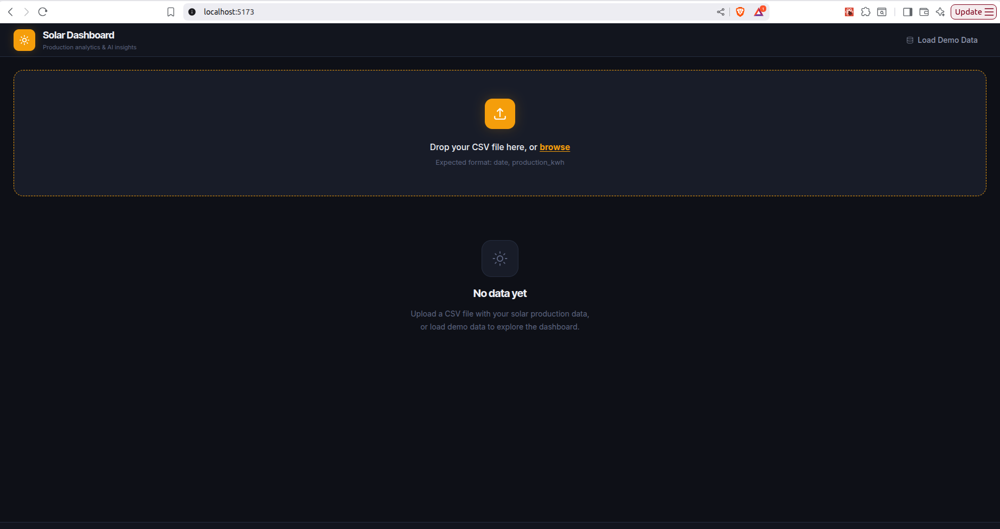
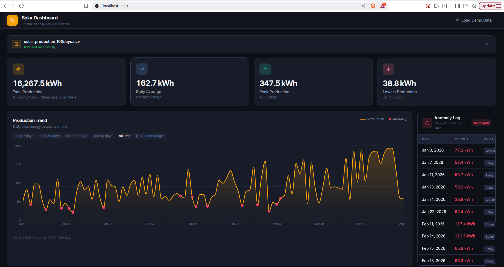
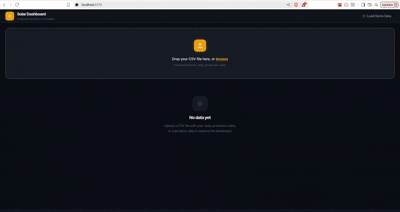

# Solar Dashboard ☀️

A full-stack **solar production analytics dashboard**.

Upload a CSV → instantly get:
- 📊 Clean metrics
- 📈 Trend visualization
- 🤖 AI-powered insights (Groq LLM)

---

## 📸 Preview

### Dashboard Overview


### Analytics View


### Demo (GIF)


---

## 🚀 Features

- 📁 Drag & drop CSV upload
- 📊 Real-time production metrics
- 📈 Interactive Recharts graph
- 🤖 AI insights using Groq API
- 📅 Date filtering (7D / 30D / 90D / All)
- 🧪 Built-in demo dataset (no upload required)

---

## 🧠 Tech Stack

### Frontend
- React + Vite + TypeScript
- Tailwind CSS
- Recharts
- PapaParse (CSV parsing)

### Backend
- Node.js + Express + TypeScript
- Groq AI API integration
- dotenv for environment variables

---

## ⚙️ How to Run

### 1️⃣ Prerequisites

Make sure you have the following installed:

```bash
node -v   # v18+
pnpm -v   # install using: npm install -g pnpm
```

---

### 2️⃣ Install Dependencies

Install dependencies separately for both the server and client applications.

#### Server

```bash
cd server
pnpm install
```

#### Client

```bash
cd ../client
pnpm install
```

---

### 3️⃣ Setup Environment Variables

Copy the example environment file:

```bash
cp server/.env.example server/.env
```

Open `server/.env` and add:

```env
GROQ_API_KEY=your_actual_groq_key_here
PORT=3000
```

👉 Get your API key from:

https://console.groq.com

---

### 4️⃣ Run the Project

Open **two terminals**.

#### Backend

```bash
cd server
pnpm dev
```

Backend runs at:

```txt
http://localhost:3000
```

#### Frontend

```bash
cd client
pnpm dev
```

Frontend runs at:

```txt
http://localhost:5173
```

---

## ⚡ Quick Start (Demo Mode)

If you do not have a CSV file, simply click:

👉 **Load Demo Data**

inside the application to explore the dashboard instantly.

---

## 📂 Project Structure
```txt
solar-dashboard/
├── client
│   ├── src
│   │   ├── components
│   │   │   ├── AIInsights
│   │   │   ├── AnomaliesTable
│   │   │   ├── DateFilter
│   │   │   ├── EmptyState
│   │   │   ├── FileStatusBar
│   │   │   ├── FileUpload
│   │   │   ├── Header
│   │   │   ├── ProductionChart
│   │   │   └── SummaryCards
│   │   ├── constants
│   │   ├── hooks
│   │   ├── pages
│   │   │   └── Home.tsx
│   │   ├── types
│   │   ├── utils
│   │   ├── App.tsx
│   │   ├── main.tsx
│   │   └── index.css
│   │
│   ├── package.json
│   ├── pnpm-lock.yaml
│   └── vite.config.ts
│
├── server
│   ├── src
│   │   ├── controllers
│   │   ├── routes
│   │   ├── services
│   │   ├── utils
│   │   ├── app.ts
│   │   └── server.ts
│   │
│   ├── logs
│   ├── package.json
│   └── pnpm-lock.yaml
│
├── public
│   ├── gifs
│   └── images
│
├── sample.csv
├── README.md
└── package.json
```

---

## 🤖 How AI Works

**Client → Server → Groq API → AI Response → Client**

- API keys are stored securely in the backend (`server/.env`)
- The frontend never exposes secrets
- `/api/ai/insights` securely handles AI requests

---

## 📄 CSV Format

### Basic Format

```csv
date,production_kwh
2026-01-01,373
```

### Advanced Format

```csv
date,site_name,daily_production_kwh,weather,anomaly_detected
2026-01-01,Site A,373,Cloudy,Yes
```

---

## 🧩 Architecture Decisions

- 🔐 Backend-only API key security (Groq)
- ⚡ Vite proxy for `/api` requests
- 📦 Client-side CSV parsing for fast processing
- 🧠 Pure utility-driven metric calculations
- 🎯 Built-in demo data for zero-friction onboarding

---

## 📌 Future Improvements

- Weather API integration 🌦️
- PDF export reports 📄
- Multi-site comparison 📊
- Database